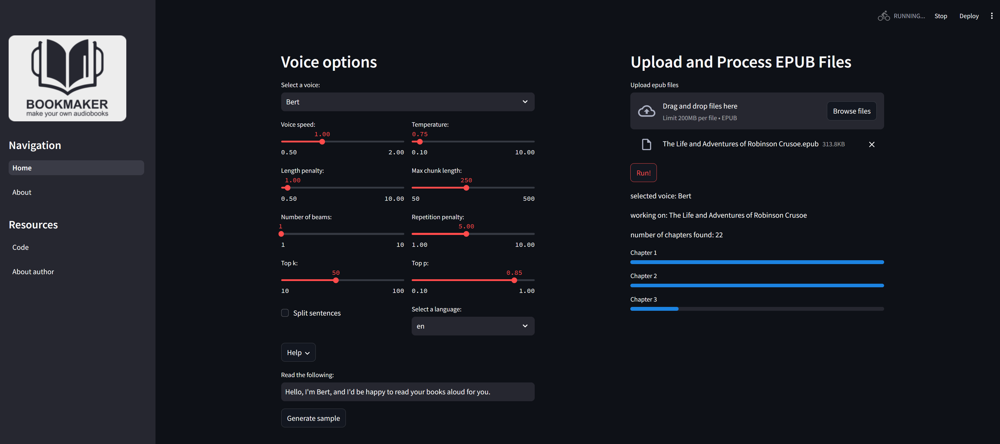

# BookMaker

<div style="text-align: center;">
    
</div>


**BookMaker** is an application that let's you turn e-Books into audio books. It's primarily intended to make literature more accessible to people with reading disabilities. But you're of course also welcome to use it if you simply prefer listening over reading.

You can choose between a number of standard voices, or use a custom voice. Support for 17 different languages is included, though it tends to work best for English text. There are also various options to modify speech, such as the speaker speed. 

The app uses XTTS V2 text to speech, as the underlying model. Text is split up into parts before generating audio to keep the memory load low. You may thus notice the tone vary between sentences from time to time. Very long sentences are broken down further, so the app will work better for literature with relatively shorter sentences.

Ideally, you would run this code on a machine with a CUDA-enabled GPU. The code is written device agnostically, so should run even when there is no GPU available. In that case, run time may be on the slow side.  

https://github.com/user-attachments/assets/20bf75d1-dd7a-4b1c-af4f-31245a8e45bf

---

### **How it looks and how to use it**

### **Preview:**



### **How to use:**

- Follow installation instructions below.
- Start up the app
- Try generating a voice sample. This will automatically download the model.
- Drag and drop an e-book or select an e-book with the file uploader, and press Run!
- After completion, your audio book is stored in the folder /path/to/app/books/


---

### **Installation on `macOS`**: 


- Install the virtual environment and the required packages:

    ```BASH
    pyenv local 3.11.3
    python -m venv .venv
    source .venv/bin/activate
    pip install --upgrade pip
    pip install -r requirements.txt
    ```
### **Installation on `WindowsOS`**:

- Install the virtual environment and the required packages:

   For `PowerShell` CLI :

    ```PowerShell
    pyenv local 3.11.3
    python -m venv .venv
    .venv\Scripts\Activate.ps1
    python -m pip install --upgrade pip
    pip install -r requirements.txt
    ```

    For `Git-Bash` CLI :

  ```BASH
    pyenv local 3.11.3
    python -m venv .venv
    source .venv/Scripts/activate
    python -m pip install --upgrade pip
    pip install -r requirements.txt
    ```

---

### **Running the app**: 
```BASH
 streamlit run app.py 
 ```
